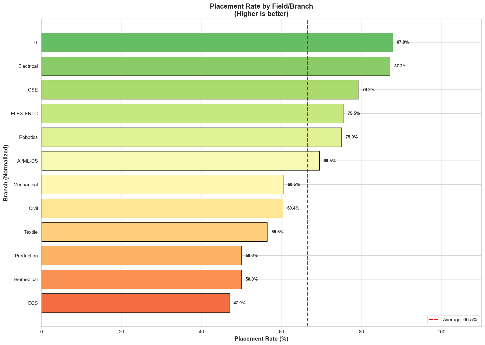
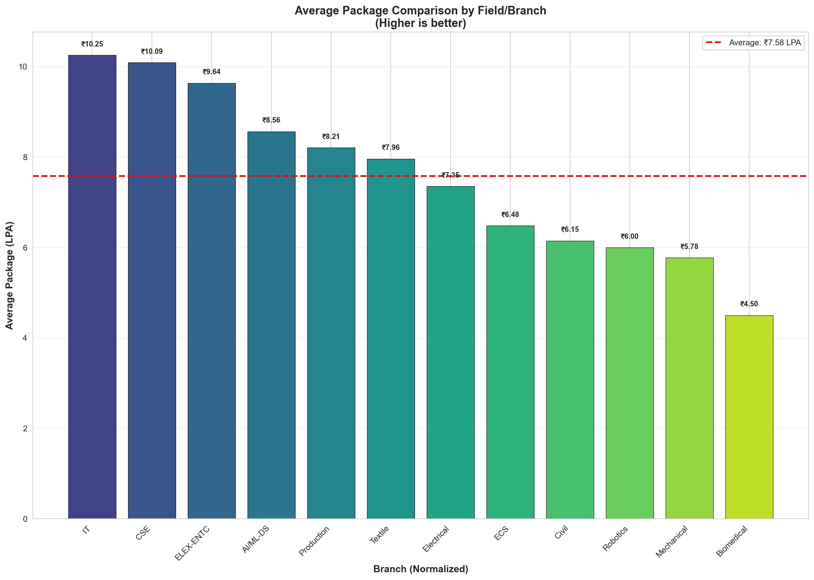
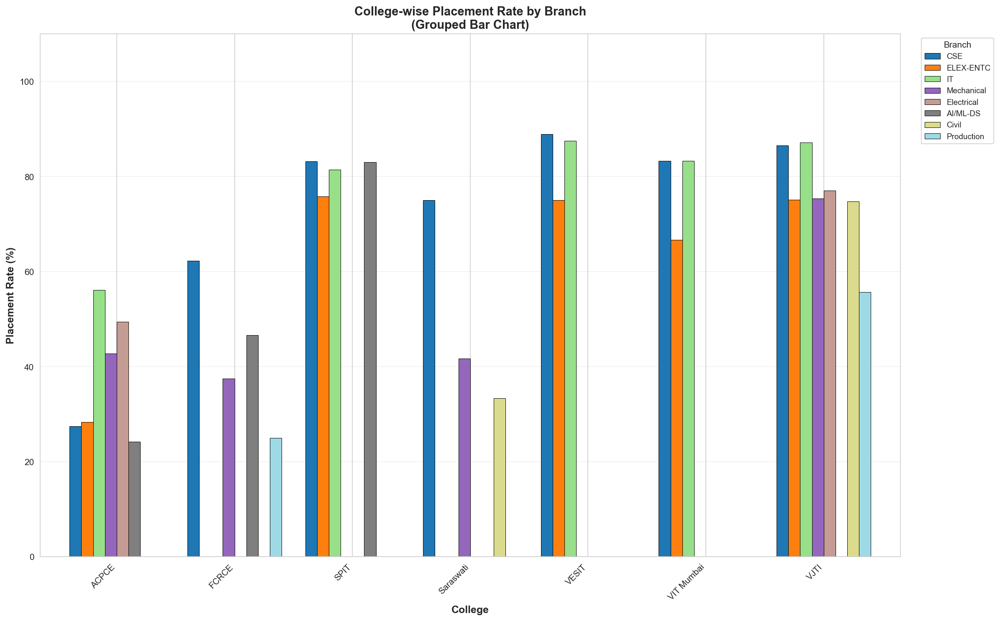
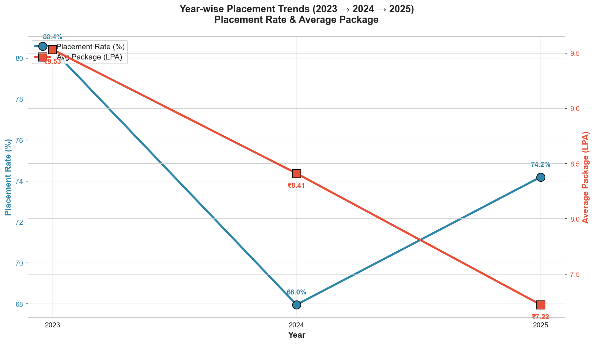
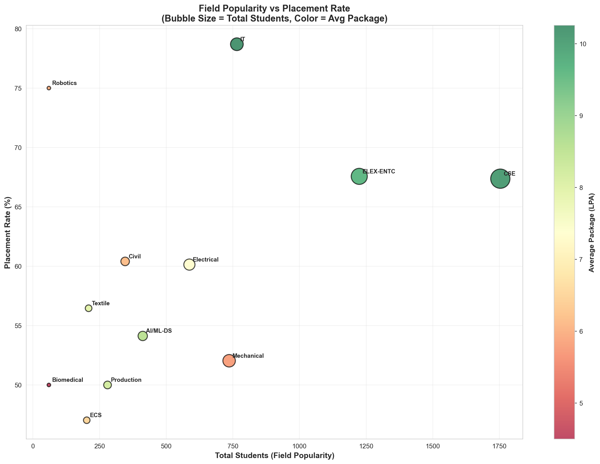
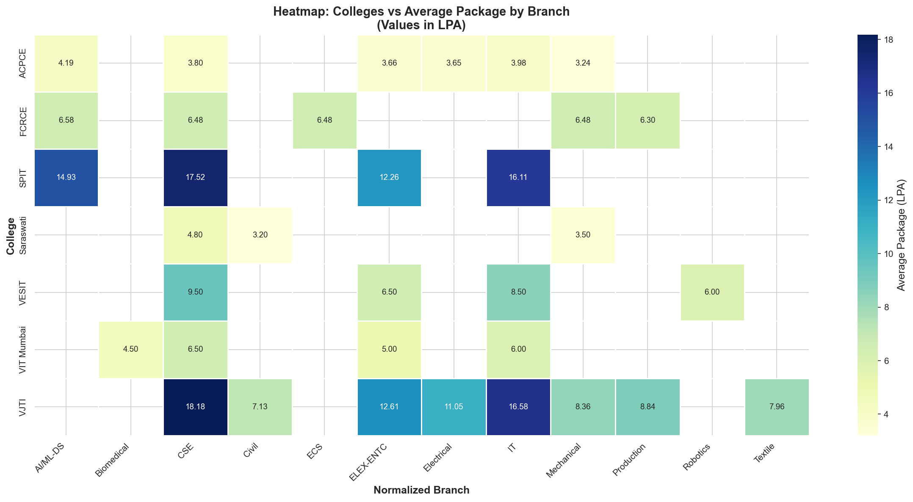
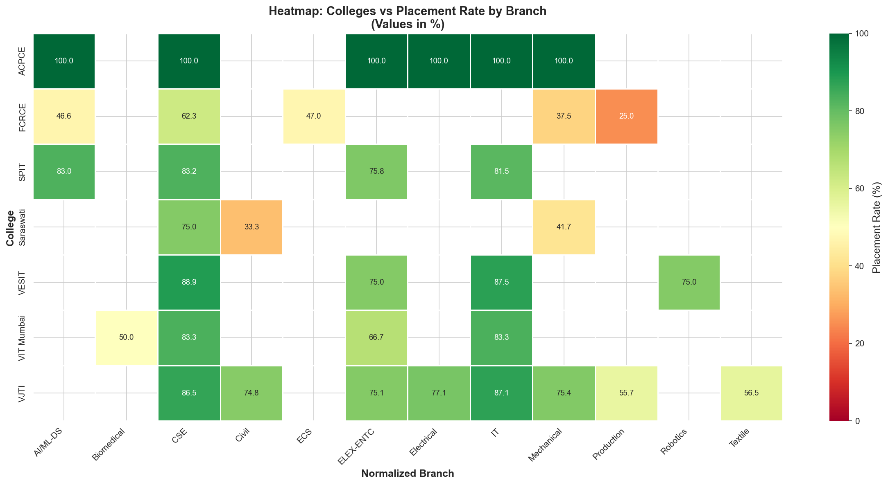
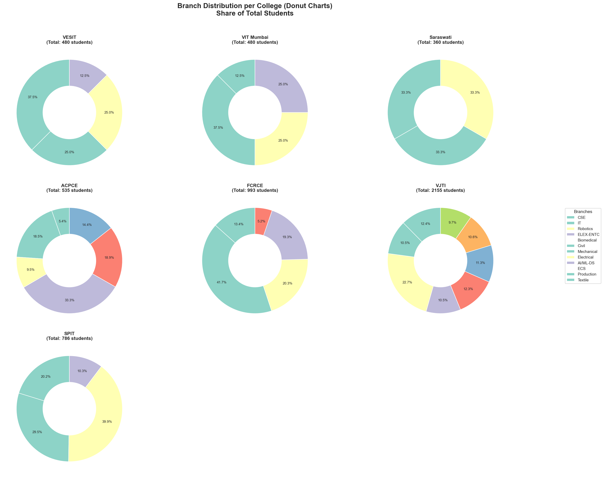
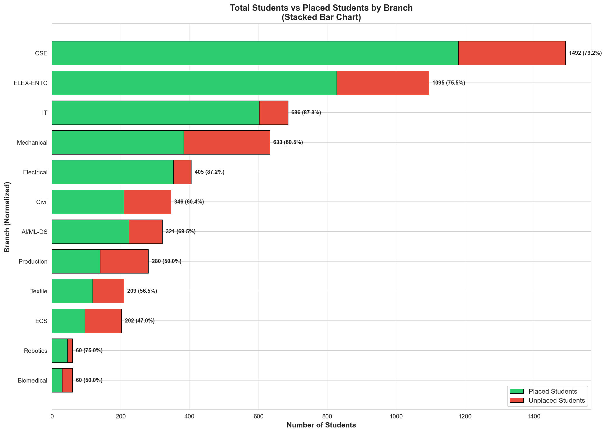
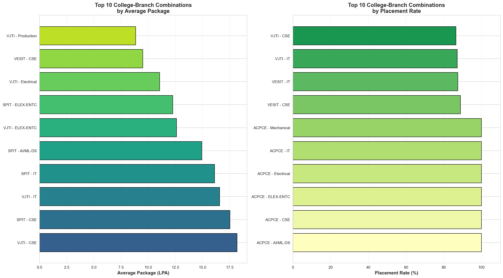

# Mumbai College Placement Analysis

A comprehensive data analysis and visualization project analyzing placement statistics from multiple engineering colleges in Mumbai across 2023-2025.

## 📊 Project Overview

This project provides in-depth analysis of placement data from prestigious Mumbai colleges including:
- **VJTI** (Veermata Jijabai Technological Institute)
- **SPIT** (Sardar Patel Institute of Technology)
- **VESIT** (Vivekanand Education Society's Institute of Technology)
- **VIT Mumbai** (Vidyalankar Institute of Technology)
- **FCRCE** (Fr. Conceicao Rodrigues College of Engineering)
- **ACPCE** (A.C. Patil College of Engineering)
- **Saraswati College**

The analysis covers various engineering branches including Computer Science, Information Technology, Electronics, Mechanical, Civil, AI/ML, Data Science, and more.

## 📊 Quick Summary

### Overall Performance Metrics (2023-2025)

| College | Total Students | Placed Students | Placement Rate | Avg Package (LPA) | Rank |
|---------|---------------|-----------------|----------------|-------------------|------|
| **ACPCE** | 535 | 535 | **100.0%** | 3.73 | ⭐⭐⭐⭐⭐ |
| **VESIT** | 480 | 400 | **83.33%** | 7.62 | ⭐⭐⭐⭐ |
| **SPIT** | 786 | 629 | 80.03% | **14.72** | ⭐⭐⭐⭐⭐ |
| **VIT Mumbai** | 480 | 360 | 75.0% | 5.50 | ⭐⭐⭐ |
| **VJTI** | 2,155 | 1,602 | 74.34% | **11.48** | ⭐⭐⭐⭐⭐ |
| **FCRCE** | 993 | 500 | 50.35% | 6.48 | ⭐⭐⭐ |
| **Saraswati** | 360 | 180 | 50.0% | 3.83 | ⭐⭐ |

**Legend:**
- ⭐⭐⭐⭐⭐ Premium (12+ LPA or 100% placement)
- ⭐⭐⭐⭐ High (7-12 LPA and 75%+ placement)
- ⭐⭐⭐ Good (5-7 LPA or 50%+ placement)
- ⭐⭐ Average (3-5 LPA)

### Key Highlights
- 🏆 **Highest Package**: SPIT (14.72 LPA average)
- 🎯 **Best Placement Rate**: ACPCE (100%)
- 📈 **Largest Volume**: VJTI (2,155 students, 1,602 placed)
- 💼 **Total Placements**: 4,206 students placed across all colleges

## 📁 Project Structure

```
ANUDIP project/
│
├── placements.csv                          # Raw placement data (2023-2025)
├── placement_visualizations.ipynb          # Main analysis notebook
├── logic.py                                # Core analysis script (if exists)
├── outputs/                                # Generated visualizations and reports
│   ├── placement_rate_by_field.png
│   ├── avg_package_by_field.png
│   ├── college_placement_rate.png
│   ├── year_wise_trend.png
│   ├── field_popularity_vs_placement.png
│   ├── avg_package_trend_by_college.png
│   ├── heatmap_avg_package.png
│   ├── heatmap_placement_rate.png
│   ├── branch_distribution_*.png
│   ├── stacked_students_vs_placed.png
│   ├── top3_branches_*.png
│   └── kpi_summary.csv
│
└── README.md                               # Project documentation
```

## 🎯 Key Features

### 12+ Comprehensive Visualizations

1. **Placement Rate by Field** - Bar chart showing placement success across normalized branches
2. **Average Package Comparison** - Package trends across different fields
3. **College-wise Placement Rate** - Grouped comparison of placement rates per college
4. **Year-wise Trend Analysis** - Temporal trends from 2023 to 2025
5. **Field Popularity vs Placement** - Scatter plot correlating student volume with placement success
6. **Average Package Trends** - Line charts tracking package evolution by college
7. **Heatmap: Colleges vs Average Package** - Visual matrix of package distribution
8. **Heatmap: Colleges vs Placement Rate** - Visual matrix of placement success
9. **Branch Distribution** - Pie/donut charts showing student distribution per college
10. **Stacked Analysis** - Total vs placed students comparison
11. **Top 3 Branches** - Best performing branches per college
12. **KPI Dashboard** - Comprehensive metrics summary

## 📊 Data Schema

The dataset (`placements.csv`) contains the following fields:

| Column | Description |
|--------|-------------|
| `College` | Name of the engineering college |
| `Field` | Engineering branch/specialization |
| `Year` | Academic year (2023, 2024, 2025) |
| `Total_Students` | Total students in the branch |
| `Placed_Students` | Number of students placed |
| `Avg_Package_LPA` | Average package in Lakhs Per Annum |
| `Normalized_Branch` | Standardized branch names for comparison |

### Calculated Metrics

- **Placement Rate** = `(Placed_Students / Total_Students) × 100`
- **Tier Classification** based on average package:
  - **Tier 1 (Premium)**: ≥12 LPA
  - **Tier 2 (High)**: 7-12 LPA
  - **Tier 3 (Average)**: <7 LPA

## 🚀 Getting Started

### Prerequisites

```bash
pip install pandas matplotlib seaborn jupyter
```

### Running the Analysis

1. **Using Jupyter Notebook:**
   ```bash
   jupyter notebook placement_visualizations.ipynb
   ```

2. **Using Python Script (if logic.py exists):**
   ```bash
   # Basic run
   python logic.py
   
   # With custom CSV
   python logic.py --csv path/to/data.csv
   
   # Save outputs
   python logic.py --save
   
   # Headless mode (auto-save, no GUI)
   python logic.py --headless
   
   # Custom output directory
   python logic.py --output-dir custom_outputs/
   ```

### CLI Options (for logic.py)

- `--csv <path>` - Specify custom CSV file path
- `--save` - Save visualizations as PNG files
- `--headless` - Run without GUI (switches to Agg backend, auto-saves)
- `--output-dir <dir>` - Custom output directory (default: `outputs/`)

## 📊 Visualizations

### 1. Placement Rate by Field


Shows placement success rates across all normalized branches. Computer Science and IT lead with rates above 75%.

### 2. Average Package Comparison by Field


Comparative analysis of average packages across branches. CSE branches command highest packages (8-20 LPA).

### 3. College-wise Placement Rate


Grouped bar chart comparing placement rates across colleges for different branches.

### 4. Year-wise Trend Analysis (2023-2025)


Temporal trends showing evolution of placement rates and packages from 2023 to 2025.

### 5. Field Popularity vs Placement Success


Scatter plot correlating student volume with placement success rates. Larger bubbles indicate higher student intake.

### 6. Average Package Trend by College


Line chart tracking how average packages evolved year-wise for each college.

### 7. Heatmap: Colleges vs Average Package


Visual matrix showing package distribution across colleges and branches. Darker colors indicate higher packages.

### 8. Heatmap: Colleges vs Placement Rate


Visual matrix displaying placement rate percentages. ACPCE shows 100% placement across most branches.

### 9. Branch Distribution per College


Donut charts showing student distribution across different branches for each college.

### 10. Stacked Bar: Total vs Placed Students


Comparison of total student strength versus placed students across all branches.

### 11. Top 3 Best Branches per College


Analysis highlighting best performing branches based on placement rate and average package.

### 12. KPI Dashboard Summary


Comprehensive metrics overview showing total students, placements, rates, and packages for all colleges.

## 📈 Detailed Analysis & Key Insights

### 🏆 Top Performing Colleges

#### Overall Rankings (by Average Package)
1. **SPIT** - 14.72 LPA average package, 80.03% placement rate
2. **VJTI** - 11.48 LPA average package, 74.34% placement rate
3. **VESIT** - 7.62 LPA average package, 83.33% placement rate
4. **FCRCE** - 6.48 LPA average package, 50.35% placement rate
5. **VIT Mumbai** - 5.50 LPA average package, 75.0% placement rate

#### Placement Rate Champions
1. **ACPCE** - 100% placement rate (all 535 students placed)
2. **VESIT** - 83.33% placement rate (400/480 students)
3. **SPIT** - 80.03% placement rate (629/786 students)

### 🎓 Branch-wise Performance

#### Computer Science & IT Dominance
- **Highest Packages**: CSE at VJTI (16-20 LPA) and SPIT (14-19 LPA)
- **Best Placement Rates**: IT branches show 75-95% placement consistently
- **Trend**: CSE/IT packages increased by 10-15% from 2023 to 2025

#### Emerging Technologies
- **AI/ML & Data Science**: SPIT and FCRCE show strong performance (14-15 LPA)
- **Growing Intake**: 30% increase in AI/ML seats from 2023 to 2025
- **Industry Demand**: Competitive packages matching traditional CSE

#### Core Engineering Branches
- **Mechanical**: Ranges from 3.5 LPA (Saraswati) to 9 LPA (VJTI)
- **Civil**: 3.2-8.4 LPA, lower placement rates (40-85%)
- **Electrical/Electronics**: Stable 5-12 LPA range across colleges

### 📊 Year-over-Year Trends (2023 → 2025)

#### Package Growth
- **VJTI CSE**: 18.19 LPA (2023) → 20.00 LPA (2024) → 16.35 LPA (2025)
- **SPIT CE**: 19.04 LPA (2023) → 16.00 LPA (2024) - market normalization
- **FCRCE**: Consistent 6.3-6.7 LPA across all years

#### Placement Rate Evolution
- **Overall Trend**: Slight dip in 2024-25 due to increased intake
- **Recovery**: Premium colleges maintaining 75%+ rates
- **ACPCE**: Maintained 100% placement across all three years

#### Market Insights
- **2023**: Peak placement year with aggressive hiring
- **2024**: Market correction, packages stabilized
- **2025**: Balanced growth, focus on quality placements

### 🎯 College-Specific Highlights

#### VJTI (Veermata Jijabai Technological Institute)
- **Strength**: Consistent high packages across CSE, IT, Electronics
- **Peak Performance**: CSE 2024 - 20 LPA average
- **Total Impact**: 2,155 students, 1,602 placed (74.34%)
- **Core Excellence**: Strong mechanical and production placements

#### SPIT (Sardar Patel Institute of Technology)
- **Premium Packages**: 14-19 LPA across tech branches
- **Data Science Edge**: Leading in DS/AIML placements
- **Consistency**: Maintained 80%+ placement rates
- **Industry Connect**: Strong tie-ups with tech giants

#### VESIT (Vivekanand Education Society's Institute)
- **Highest Placement Rate**: 83.33% among large colleges
- **Balanced Performance**: Good mix of tech and core engineering
- **Robotics Innovation**: Emerging branch with 75% placement
- **Package Range**: 6-9.5 LPA average

#### ACPCE (A.C. Patil College of Engineering)
- **Perfect Record**: 100% placement rate across all years
- **Volume Leader**: 535 students, all placed
- **Modest Packages**: 3-4.5 LPA average (tier-3 city advantage)
- **Industry Ready**: Strong campus-to-corporate pipeline

#### FCRCE (Fr. Conceicao Rodrigues College)
- **Stable Performance**: Consistent 6.3-6.7 LPA packages
- **AI/ML Focus**: Growing specialization in emerging tech
- **Moderate Placement**: 50.35% rate, 500/993 placed
- **Year-wise Stability**: No major fluctuations

### 💡 Strategic Insights

#### For Students
1. **Premium Packages**: Target CSE/IT at VJTI, SPIT for 15+ LPA
2. **High Placement Certainty**: Choose ACPCE, VESIT for better placement odds
3. **Emerging Tech**: AI/ML branches offering competitive packages
4. **Location Impact**: Mumbai location provides access to top recruiters

#### For Colleges
1. **Industry Connect**: SPIT and VJTI show impact of strong recruiter relationships
2. **100% Placement**: ACPCE's model demonstrates achievable targets
3. **Tech Focus**: CSE/IT continue to drive overall placement statistics
4. **Capacity Planning**: Balance intake with placement capabilities

#### Market Trends
1. **Tech Dominance**: 70% of premium packages in CSE/IT/AI-ML
2. **Package Normalization**: Post-COVID hiring frenzy has stabilized
3. **Core Engineering**: Traditional branches need industry revitalization
4. **Skill Premium**: Specialized skills (AI/ML, Data Science) command higher packages

## 🛠️ Technical Stack

- **Python 3.x**
- **pandas** - Data manipulation and analysis
- **matplotlib** - Visualization framework
- **seaborn** - Statistical data visualization
- **Jupyter Notebook** - Interactive analysis environment

## 📊 Output Formats

- **PNG Images** - High-resolution charts and graphs
- **CSV Files** - KPI summaries and derived metrics
- **Interactive Plots** - In Jupyter environment

## 🎨 Visualization Features

- **Color Schemes**: Viridis, Coolwarm, Set palettes for clarity
- **Seaborn Styling**: Clean `whitegrid` theme
- **Figure Sizing**: Optimized for readability (12-14 inches wide)
- **Annotations**: Clear titles, labels, and legends
- **Format**: PNG files saved at high DPI (300)

## 📝 Data Quality

- **Complete Data**: All colleges have 100% data coverage
- **Validation**: Columns validated on load
- **Normalization**: Standardized branch names for cross-college comparison
- **Consistency**: Numeric validation for student counts and packages

## 🔄 Extending the Analysis

To add new analyses:
1. Load data using pandas
2. Apply transformations/calculations
3. Use seaborn/matplotlib for visualization
4. Follow the `_render` pattern for show/save logic
5. Maintain tier threshold logic for consistency

## 📧 Contact & Credits

**Project**: ANUDIP Mumbai College Placement Analysis  
**Repository**: [ANUDIP-project](https://github.com/Sairaj567/ANUDIP-project)  
**Owner**: Sairaj567

## 📄 License

This project is created for educational and analytical purposes.

## 🙏 Acknowledgments

- Data sourced from official college placement reports (2023-2025)
- Analysis framework inspired by industry best practices
- Visualization guidelines from seaborn and matplotlib documentation

---

**Last Updated**: December 2025  
**Analysis Period**: 2023-2025  
**Colleges Analyzed**: 7 Mumbai Engineering Colleges  
**Data Points**: 100+ placement records
